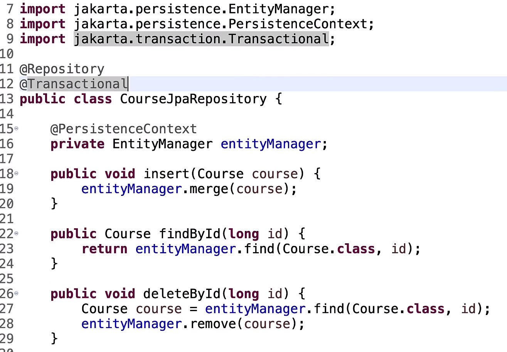

### Spring JDBC:
1. Less java code and more sql code.
2. **JdbcTemplate** is used to execute queries.In below code query can contain delete , insert , update etc.
```java
springJdbcTemplate.update(query, param1, param2);
```
3. Use **@Repository** annotation for Jdbc class 
   
4. question mark and variable are order dependent.
5. Bean is need to be specified in order to get the rows in form of course objects. id is particular column that you want to filter upon. Class should contain setters(or contructor ?) else data will not be initialize.
```java
springJdbcTemplate.queryForObject(selectQuery,new BeanPropertyRowMapper<>(Course.class), id);
```

The above approach will make the classes grow as queries grow. 
Another solution is to map the class directly to database.
In order to do that , you have to mark the class with `@Entity` annotation.

### JPA and EntityManager:

1. Here the `(name="something")` is not required if the property name and class name are matching with database table and columns.
2. In order to manage these `Entity`, you have to use `EntityManager`.  Here PersistenceContext is similar to `@Autowired` but for `EntiyManager` specifically.


3. `EntityManager` provides apis out of the box to query or update  database.
4. `@Transactional` annotation is mandatory on Repository.

### Spring Data JPA:

Makes database interaction way more easy than `JPA`. It out of the box provides all functionality without writing anything.
Entity wil remain unchanged.


In Repository, it needs two types:\
-> `Entity name:` `Course` in this case\
-> `Entity id type`: `Long` in this case\


We can also add custom methods in `CourseSpringDataJpaRepository`. You need to follow the naming convention, the functionality will be provided by SpringJPA.\
`List<Course> findByAuthor(String author);`\
Only this line will allow you to query on author column.

### Important Notes:
1. H2 is inmemory database that we can use.
2. Thing about in memory database is that data gets wiped once application is stopped.
3. `findById`, `findByAuthor` etc. returns `optional` type, it is to force the user to write check condition in case there is no course. 
   e.g. 
   ```java
   @GetMapping("/courses/{id}")
   public Course getCourseById(@PathVariable long id) { 
      Optional<Course> filteredCourse = repository.getCourseById(1);
      if (filteredCourse.isEmpty()) {
         throw new RuntimeException("Course not found!");
      }

      return filteredCourse.get();
   }
   ```