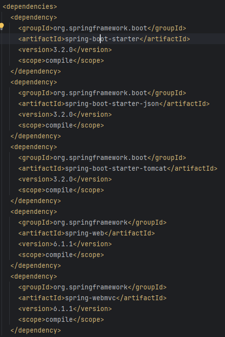

### Jakarta Context & Dependency Injection (CDI):

1. CDI is a specification (interface). Spring framework implements CDI.
2. Important Annotations:
   * Inject - same as Autowired in Spring.
   * Named - same as Component in Spring.
   * Qualifier
   * Scope
   * Singleton
3. Stereotype Annotations:
   * Component - POJO or model class
   * Service - If a class has business logic
   * Repository - If the class is interacting with DataStorage, DB etc.
   * Controller

### Spring Boot vs Traditional Approach:
1. Spring boot provides following out of the box features which were needed to be manually configured earlier.
   * **Tomcat** server within jar files(embedded server)
   * **Auto configuration** - that includes required packages to fast creation of java app.
   * **Maven** integration provides package management and generation of build files, as well as jar file.
2. Spring boot starter web dependency provides automatic json conversion for http responses via `spring-boot-starter-json` artifact.

Important notes:
Run jar file: **java -jar name-of-thejar.jar**

### Spring Boot Actuator:

1. Monitoring and manage your application in production.
2. We need to add `spring-boot-starter-actuator` dependency.

### Spring Boot DevTools:
1. Add `spring-boot-devtools` artifact.
2. It will reflect changes you make without restarting the server manually.
3. In case of dependency update in pom.xml, you will have to restart manually. But in case of java updates, that will be updated automatically.